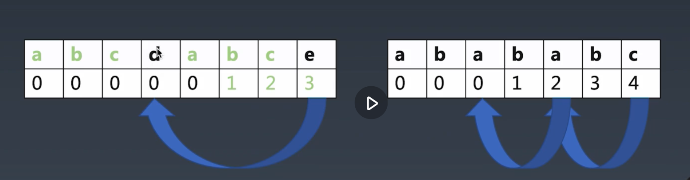

# 1. 字符串分析算法|总论
  * 字典树（用来精确地匹配字符串和模式的，检查两个字符串是否完全匹配，比如搜索关键词）
    * 大量高重复字符串的存储与分析
  * KMP（部分匹配，一个字符串是否是另一个字符串的部分）
    * 在长字符串里找模式
  * Wildcard（在KMP的基础上又加了通配符 ? 匹配任意字符 * 匹配任意数量的任意字符）
    * 带通配符的字符串模式
  * 正则
    * 字符串通用模式匹配
  * 状态机 （和正则类似，但和正则的区别是状态机还可以往里嵌代码去对字符串做额外的处理，写起来没有正则方便）
    * 通用的字符串分析
  * LL LR
    * 字符串多层级结构分析

# 2. 字典树
  可以理解成为查字典，根据单词的第一个字母去看到哪里去找，之后再根据第二个第三个字母顺序，不断重复查找，直到查找到该单词， 将这个查字典的行为，变成一个树形结构，就是字典树(trie)了。
# 3. KMP
  字符串的模式匹配算法：查一个字符串里有没有另一个字符串
  不考虑KMP算法，可以使用暴力解法（Brute-Force）：从长字符串的每个节点开始去匹配pattern（我们要查找的字符串），时间复杂度为m*n，即原串的长度m和要查找的字符串的长度n
  > a b c d a b c e
  >               j
  > a b c d a b c d a b c e x
  >               i
  > 因为串本身就有重复，可以证明，前面的abc肯定是已经匹配的，所以j直接移回到d的位置
  > 可以看到两个d又匹配上了，那么就可以继续同时移动i j 往前走。而不需要回到最前面去
  >
  > a b c d a b c e
  >       j        
  > a b c d a b c d a b c e x
  >               i
  
  关注字符串的自重复行为，将字符串逐位截断，再看有没有公共的最长的前面的子串
  > abcdabce
  > bcdabce
  > cdabce
  > dabce
  > abce
  > bce
  > ce
  > e

  kmp匹配跳转表格：描述自重复特性，创建和该模式串长度相同的一个数组，然后在里面分别填上到此时已经有几个字母是重复的了。
  > abcdabce        abababc
  > 00000123        0001234
  > 当我们做原串和模式串对比时，如果发现模式串e不能匹配时，我们先不着急回到最开始状态，可以先看一看前面有几位是重复的，将模式串里面的位置> 跳到重复的位置，即 d，然后看d匹不匹配，，如果d匹配，还是从d开始,如果d不匹配，d位置对应是0，那么就跳到0开始匹配
  

# 4. Wildcard
  Wildcard 加入了两种通配符
  Wildcard：ab*c?d*abc*a?d
    只有*：ab*cd*abc*a?d
     最后一个*和前面的*是不一样的，因为最后一个*可以尽可能地匹配多个字符而不管前面剩了多少字符，前面的*可以尽量少的匹配，第一个*之前的字符 ab ，只匹配开头的几个字符，最后一个*后面的部分，只匹配尾巴上的几个字符。中间的不管多少段，相当于一个*+一个字符作为一组（在字符串里去找一个特定pattern的字符，即kmp算法）
    只有?：c?d, a?d
  